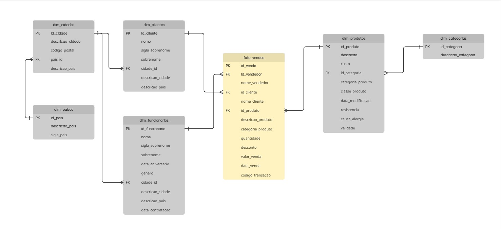

# 🧠 MVP Engenharia de Dados

Este projeto tem como objetivo construir uma **arquitetura de dados em camadas (Bronze, Silver e Gold)** para processar, modelar e analisar um conjunto de dados de vendas. O objetivo principal é gerar **insights de negócio** que auxiliem na tomada de decisão estratégica.

## 📌 Objetivos do Projeto

- Implementar um fluxo completo de ingestão, tratamento e análise de dados;
- Criar uma arquitetura escalável usando **Delta Lake** no **Databricks**;
- Aplicar **modelagem dimensional** para facilitar a análise;
- Responder perguntas de negócio a partir de dados confiáveis.

---

## 🏗️ Arquitetura em Camadas

### 🥉 Bronze – Dados Brutos
Armazena os arquivos originais (.csv), com padronizações mínimas:
- `bronze.raw_categorias`
- `bronze.raw_cidades`
- `bronze.raw_paises`
- `bronze.raw_clientes`
- `bronze.raw_funcionarios`
- `bronze.raw_produtos`
- `bronze.raw_vendas`

### 🥈 Silver – Dados Tratados
Modelagem dimensional, com tabelas de dimensão e fato:
- `silver.dim_clientes`, `silver.dim_produtos`, `silver.dim_funcionarios`
- `silver.dim_cidades`, `silver.dim_paises`, `silver.dim_categorias`
- `silver.fato_vendas`

#### 🧩 Modelo de Entidade-Relacionamento

A seguir, é apresentado o modelo de entidade-relacionamento construído a partir das tabelas da camada *Silver*, com base no processo de modelagem dimensional. Esse modelo define claramente as relações entre as tabelas de dimensão e a tabela fato, permitindo uma estrutura robusta para análises futuras.

#### 📷 Diagrama MER

> *Figura: Modelo de Entidade-Relacionamento.*

### 🥇 Gold – Dados Analíticos
Agregações e resumos voltados para análise:
- `gold.vendas_resumo_mensal`
- `gold.compras_clientes_resumo_mensal`
- `gold.vendas_local`
- `gold.vendas_func`
- `gold.top_produtos`
- `gold.ultima_venda_produto`
- `gold.ticket_medio_produto`
- `gold.recencia_clientes`

---

## 🔎 Exemplos de Análises Realizadas

- **Clientes mais ativos** por mês, em número de compras e valor gasto;
- **Evolução das vendas** ao longo do tempo;
- **Localidades com maior volume de vendas**;
- **Produtos mais vendidos** e com maior ticket médio;
- **Recência de compra dos clientes**;
- **Funcionários com maior performance** em vendas.

---

## 🧱 Modelagem Dimensional

Utilizou-se a **abordagem em floco de neve (Snowflake Schema)**:

- **Tabela Fato:** `fato_vendas`
- **Tabelas Dimensão:** `dim_clientes`, `dim_produtos`, `dim_funcionarios`, `dim_cidades`, `dim_paises`, `dim_categorias`

Essa modelagem facilita:
- Cálculos de métricas como **ticket médio, recência, frequência**;
- Análises por **localidade, produto, funcionário ou cliente**;
- Expansão futura com novas granularidades.

---

## 🧪 Tecnologias e Ferramentas

- **Databricks / PySpark / Delta Lake**
- **SQL** para criação e transformação de tabelas
- **Arquivos CSV** como fonte de dados
- **Notebook em formato `.ipynb`** (Jupyter / Databricks)

---

## ✅ Status

- ✅ Camada Bronze concluída
- ✅ Camada Silver com modelagem dimensional implementada
- ✅ Camada Gold com análises e KPIs

---

## 📁 Organização dos Dados

Os dados estão organizados no formato **Delta**, com tabelas persistidas no catálogo do Databricks, e com esquema definido para cada camada.

---

## 🤔 Autoavaliação

> "Acredito que atingi 80% dos objetivos propostos. Consegui construir as 3 camadas da arquitetura, fazer as modelagens necessárias, realizar análises significativas com base nos dados e criar catálogos detalhados. Ponto de melhoria seria investir mais em análises avançadas e visualizações."

---

****
